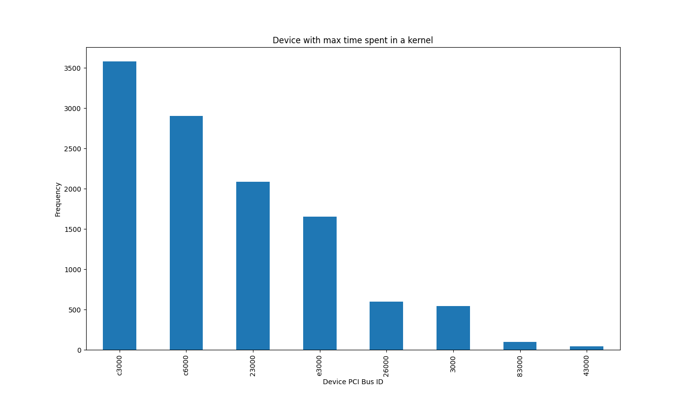

# Collective Trace Processor

This tool is used to collect RCCL collective traces. 

## Requirement 
Due to the newly-added information (PCI bus ID) for the collective API trace mode in ROCm 4.3, the build with this fork is required for the tool.

From ROCm 4.3:
NCCL_DEBUG=INFO NCCL_DEBUG_SUBSYS=INIT,COLL only enable collective API trace. Kernel trace is enabled separately by RCCL_KERNEL_COLL_TRACE_ENABLE=1 which has new format as below:

```
[0] NCCL INFO ## [1703255.821541] [01:00] 000035 KL HWID 4230c540 AllReduceTreeLLSum_f32 nt 256 bi 0 nc 1 busId C3000
```


## Usage
For more information about RCCL collective traces, please go to [here](https://confluence.amd.com/display/MLSE/RCCL+Collective+Trace).

Example command line:
```shell
python process_coll.py --rccl-debug-log gpt2_rccl_mp4_log_coll_trace.txt
```


## Example Output
The frequency of devices with maximum time spent in a kernel (unique opCount) for a RCCL log file of an application is visualized.


In addition, the tool also populates timings of each op for every devices in a csv file.

## TODO
- The current tool does not work with the cases when a opCount contains more than one operation with different nRank.
- More tools shall be created based on the new commit (e.g. device_grouping, unique_command, trace_processor for multiple device groups). 

## Copyright
All source code and accompanying documentation are copyright (c) 2019-2020 Advanced Micro Devices, Inc. All rights reserved.
